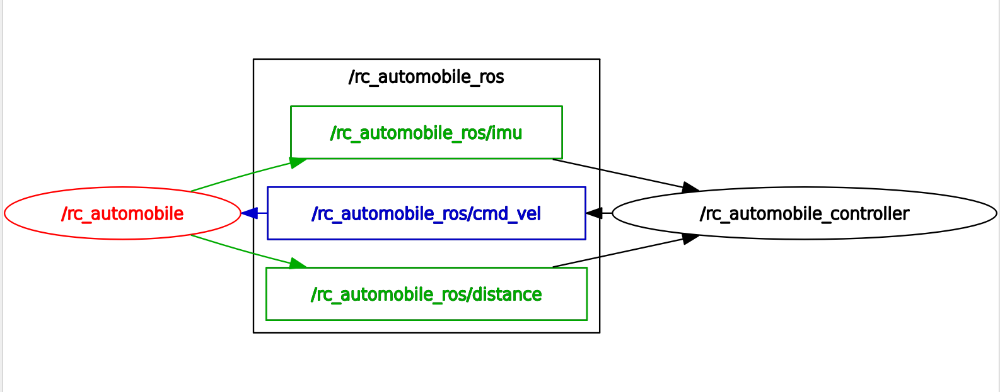

# ROS AUTOMOBILE

## Description

This repository contains the code for a remake of the [rc-automobile](https://github.com/SmallBotic/rc-automobile) project. The project aims to modify the original project and make it controllable through ROS via Micro-ROS.

## Communication Diagram

The following diagram shows the communication between the Micro-ROS automobile and the ROS 2 control node:


## Table of Contents

- [Communication Diagram](#communication-diagram)
- [Description](#description)
- [Table of Contents](#table-of-contents)
- [Installation](#installation)
  - [Dependencies](#dependencies)
  - [Building](#building)
  - [Using PlatformIO in Visual Studio Code](#using-platformio-in-visual-studio-code)
  - [Using PlatformIO in the terminal](#using-platformio-in-the-terminal)
- [Usage](#usage)
  - [Running the project](#running-the-project)
    - [Note](#note)

## Installation

### Dependencies

- ROS Humble
- Micro-ROS
- PlatformIO installed in your computer or the PlatformIO extension in Visual Studio Code

### Building

### Using PlatformIO in Visual Studio Code

1. Clone the repository in your workspace
2. Open the project in Visual Studio Code
3. Build the project using the PlatformIO extension

### Using PlatformIO in the terminal

1. Clone the repository in your workspace
2. Open the terminal in the project directory
3. Run the following command to build the project:

    ```bash
    pio run
    ```

## Usage

### Running the project

1. Connect the microcontroller to the computer using a USB cable
2. Run the following command to upload the code to the microcontroller:

    ```bash
    pio run --target upload
    ```

3. Open a new terminal and run the following command to start the Micro-ROS agent:

    ```bash
    ros2 run micro_ros_agent micro_ros_agent udp4 --port 8888 # or whatever you specified in Credentials.h
    ```

#### Note

Please check the [Micro-ROS documentation](https://micro.ros.org/docs/tutorials/core/first_application_linux/) for more information on how to set up the Micro-ROS agent.

For this project, setting up the agent is explained [here](https://github.com/jetsup/SimpleHacks/blob/master/ros/micro_ros_basic_agent.md).
